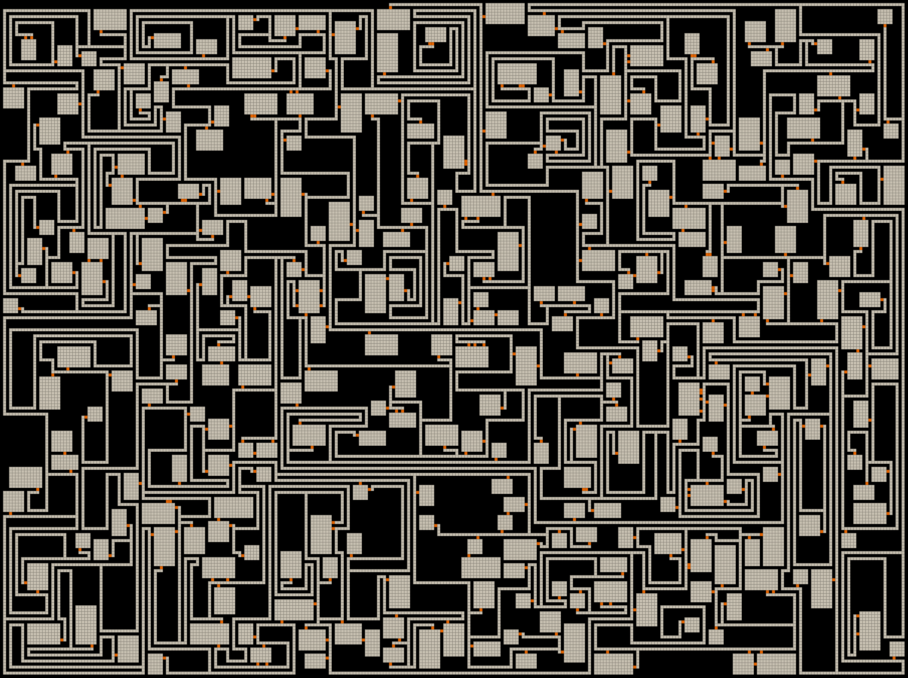

# Dungeon Generator
Generates a random dungeon.  This is based entirely off of the great blog post by [Bob Nystrom](http://journal.stuffwithstuff.com/2014/12/21/rooms-and-mazes/).



## Command Line Arguments
``` text
dungeon_generator 
Generates a random dungeon

USAGE:
    dungeon_generator [OPTIONS]

OPTIONS:
    -a, --attempts <ATTEMPTS>    The number attempts the program should use to place rooms [default:
                                 200]
        --animate                Generates a PPM stream (intended for created video with ffmpeg, etc
                                 ...)
    -h, --height <HEIGHT>        The height of the dungeon in "grids" (This number must be odd)
                                 [default: 91]
        --help                   Print help information
    -w, --width <WIDTH>          The width of the dungeon in "grids" (This number must be odd)
                                 [default: 121]
```

## Animation
If you pipe to `ffmpeg` with the `--animate` argument, you can also view how the dungeon is actually generated (along with some completely unnecessary coloration).


